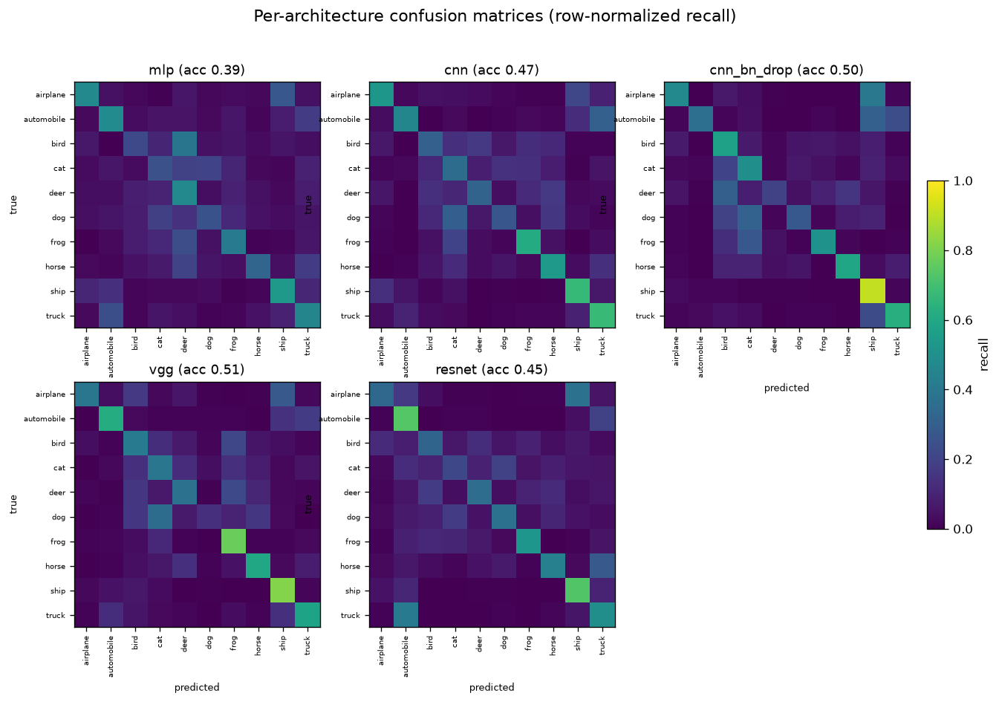
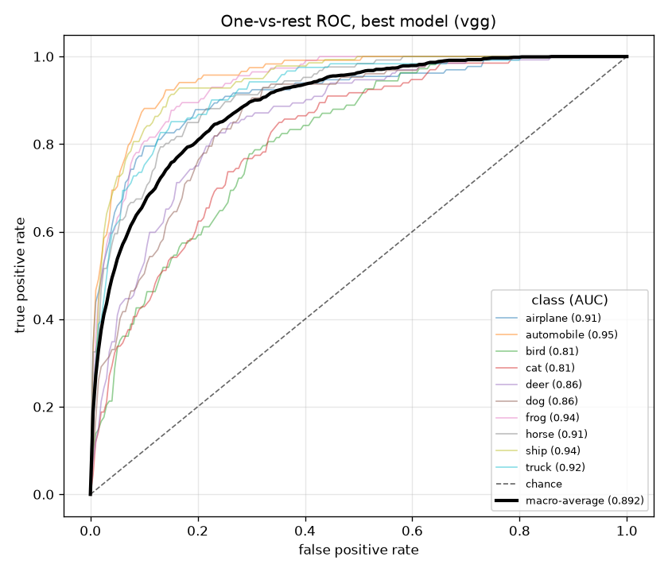

# image-classification-pytorch

An empirical study of image-classification architectures on CIFAR-10. Five
configurations, a plain MLP, a small CNN, the same CNN with batch norm and
dropout, a compact VGG-style stack, and a ResNet-style network with skip
connections, are trained under one fixed budget and compared, with a separate
regularization ablation on the small CNN. Every run is config-driven and seeded,
so the numbers below reproduce.

## Results

Produced this session by `python scripts/run_all.py --data cifar --subset 2500 --epochs 6`.
A 2500-image training subset and 1250-image test subset of CIFAR-10, Adam at
1e-3, batch size 128, fixed seed 0. Reported accuracy is the best-by-validation
checkpoint, not the last epoch. Chance on ten classes is 0.10.

| Architecture | Best test accuracy | Best epoch |
| --- | --- | --- |
| mlp | 0.3904 | 4 |
| cnn | 0.4744 | 6 |
| cnn_bn_drop | 0.5024 | 6 |
| vgg | 0.5072 | 5 |
| resnet | 0.4528 | 6 |

Best model: vgg at 0.5072 test accuracy, macro-averaged one-vs-rest ROC AUC 0.892.

### Hero figure: per-architecture confusion matrices

Each panel is one architecture's confusion matrix, row-normalized so the
diagonal reads as per-class recall on a shared 0-to-1 scale. This makes the
five models directly comparable at a glance, and shows the familiar CIFAR-10
confusions (cat and dog, automobile and truck) surviving in every model.



One-vs-rest ROC curves for the best model:



### Regularization ablation (small CNN)

Each variant toggles one regularizer on the same three-block CNN, all else equal.

| Variant | Batch norm | Dropout | Weight decay | Best test accuracy |
| --- | --- | --- | --- | --- |
| plain | no | 0.0 | 0.0 | 0.4744 |
| batchnorm | yes | 0.0 | 0.0 | 0.5168 |
| dropout | no | 0.3 | 0.0 | 0.4592 |
| weight_decay | no | 0.0 | 0.0005 | 0.4792 |
| all | yes | 0.3 | 0.0005 | 0.5024 |

In this regime batch normalization is the single most useful regularizer, lifting
the plain CNN from 0.4744 to 0.5168. Dropout on its own slightly hurts at this
scale, since the network is already data starved and dropout removes capacity it
cannot yet spare. Combining all three lands between the two, which is a sensible
and honest outcome for such a small budget.

## The small-data caveat

These numbers are a controlled comparison, not a benchmark result. Training uses
a 2500-image subset for a handful of epochs so the whole suite finishes in a
couple of minutes on a CPU. In this short-budget, small-data regime the
higher-capacity networks (vgg, resnet) are iteration and data starved, so their
extra depth barely pays off and the compact models stay competitive. This is
expected. The place where the deeper networks are expected to pull ahead is the
full dataset with a longer budget, which you can run with `--subset 0 --epochs 30`
(slow on CPU). What the study does show cleanly and reproducibly: convolution
beats a flatten-then-dense MLP by a wide margin, and batch norm is the most
effective of the three regularizers here.

## Method

Five model builders sit behind one factory in `src/imgclf/models.py`:

- `mlp`: flatten then two dense layers. Ignores spatial structure, sets the floor.
- `cnn`: three 3x3 conv blocks with max pooling. The convolutional baseline.
- `cnn_bn_drop`: the same CNN with batch norm and dropout.
- `vgg`: a compact VGG-style stack of paired 3x3 conv blocks with batch norm.
- `resnet`: a small residual network with skip connections and strided downsampling.

Each experiment is a small YAML file under `configs/` describing one architecture
plus its training budget. The runner in `scripts/benchmark.py` loads a directory
of configs, trains each model, tracks the best-by-validation checkpoint, and
writes `results/metrics.json` plus the figures. `scripts/run_all.py` drives the
architecture comparison and the regularization ablation in one call and renders
`RESULTS.md`. Seeds are fixed for Python, NumPy, and PyTorch, so a rerun
reproduces the tables.

## Usage

Install into a fresh environment:

```
python -m venv .venv
.venv\Scripts\activate      # Windows, or: source .venv/bin/activate
pip install -e ".[dev]"
```

Python 3.11 or newer. On a machine without a prebuilt torch wheel, install the
CPU build first: `pip install torch torchvision --index-url https://download.pytorch.org/whl/cpu`.

### Offline quickstart (no network)

A small, class-balanced CIFAR-10 sample is committed under `data/`, so the whole
pipeline runs with no download:

```
python scripts/benchmark.py --configs configs --data data/cifar10_sample.npz --epochs 3
```

This trains all five architectures on the 400-image sample, then writes the
confusion-matrix grid and ROC figure into `results/`. Accuracy on the sample is
low by design (a few hundred images is far too few to learn from); the point is
that the full pipeline runs end to end offline.

### Full comparison

```
python scripts/download_data.py --root data                       # fetch full CIFAR-10
python scripts/run_all.py --data cifar --subset 2500 --epochs 6   # the tables above
python scripts/run_all.py --data cifar --subset 0 --epochs 30     # full data (slow on CPU)
pytest -q                                                          # tests, fully offline
```

The demo notebook `notebooks/demo.ipynb` walks through the same comparison with
saved outputs.

## What it does not do

- No data augmentation, learning-rate scheduling, or long training runs. Absolute
  accuracy is well below full-dataset state of the art by design.
- No pretrained backbones or transfer learning. Every network trains from random
  initialization.
- No hyperparameter search. Each architecture uses one fixed configuration.

## Layout

```
src/imgclf/         library code: models, data, trainer, config, metrics
configs/            one YAML per architecture, plus configs/ablation/
scripts/            benchmark.py, run_all.py, make_sample.py, download_data.py
results/            committed figures, metrics.json, ablation.json, small checkpoint
data/               committed sample .npz, full CIFAR-10 gitignored
notebooks/          demo.ipynb with executed outputs
tests/              pytest suite, runs on synthetic data offline
```

The committed `results/resnet_checkpoint.pt` is the trained ResNet-style network
from this session, kept for a quick load-and-infer check. Per-run checkpoints go
to `checkpoints/` and are gitignored.

## Tests

```
pytest -q        # 12 tests: model shapes, config parsing, metrics, sample loading, training
ruff check .
```

## Author

Aamir Malik

- GitHub: https://github.com/aamirmalik-dr
- LinkedIn: https://linkedin.com/in/dr-aamirmalik

## License

MIT, see LICENSE.

---

*Refactored and engineered into this tested, reproducible project in July 2026, from work originally done for the Machine Learning for Knowledge Service course at KAIST (Spring 2019).*
